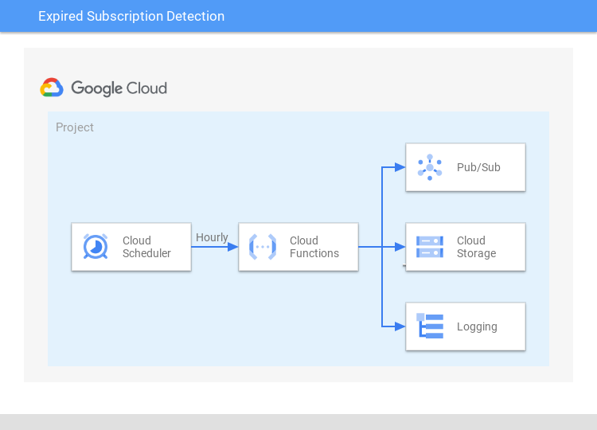

Subscription Expiration Detection
===============================================================================

This application reports on subscriptions that are no longer attached to a topic.  
This is accomplished by comparing consequtive reports of active subscriptions
taken at an hourly interval.

Overview
-------------------------------------------------------------------------------

By default, subscriptions expire after 31 days of inactivity (for instance, if there are no active connections, pull requests, or push successes). 
If subscription expiration policy has been set, subscriptions expire after set duration of inactivity. [1]_  

Currenty (June 2023), an expiration event logged against the topic does not include subscription if the subscriber is from a different project.  To identify these expired subscriptions, 
this application periodically lists all the subscriptions in a project and logs the difference between a previous listing.

Approach
-------------------------------------------------------------------------------
This application uses Cloud Scheduler to trigger a Cloud Function on an hourly basis that:

#. Lists the current subscriptions in a project
#. Retreives a previous subscription listing stored in Google Cloud Storage (GCS)
#. Writes to Cloud Logging the set of subscriptons present in the previous listing not present in the current listing
#. Overwrites the listing stored in GCS with current set of subscribers

Installation
-------------------------------------------------------------------------------

Prerequisites
+++++++++++++

The installation requires the Terraform client (version 1.5.0 or greater [2]_)

Installation Steps 
++++++++++++++++++

#. Download this contents of this repository
#. Optional In ``main.tf``, change the local variable ``region`` from ``us-central1`` to the region of your choice
#. Specify the project in which to deploy and execute the application

    .. code:: bash

        $ export GOOGLE_PROJECT=<poject-id>

#. In the directory where the contents were downloaded, executeCommand

    .. code:: bash

        $ terraform init 
        $ terraform apply -auto-approve

Log Messages
-------------------------------------------------------------------------------

After installation, a log message will be written to Cloud Logging each hour containing an array of topics with 
the subcriptions that are no longer attached.  Topics with no change will not be listed.

The log messages are labled with ``payload_desc: "expired subscriptions"`` and can be filtered in the Cloud Logs Explorer with:

    .. code:: text

        resource.type="cloud_function" resource.labels.function_name="expiration-identifier" 
        labels.payload_desc="expired subscriptions"

References 
++++++++++

.. [1] https://cloud.google.com/knowledge/kb/pub-sub-subscriptions-disappeared-without-any-deletion-logs-000004170#cause
.. [2] https://developer.hashicorp.com/terraform/downloads
